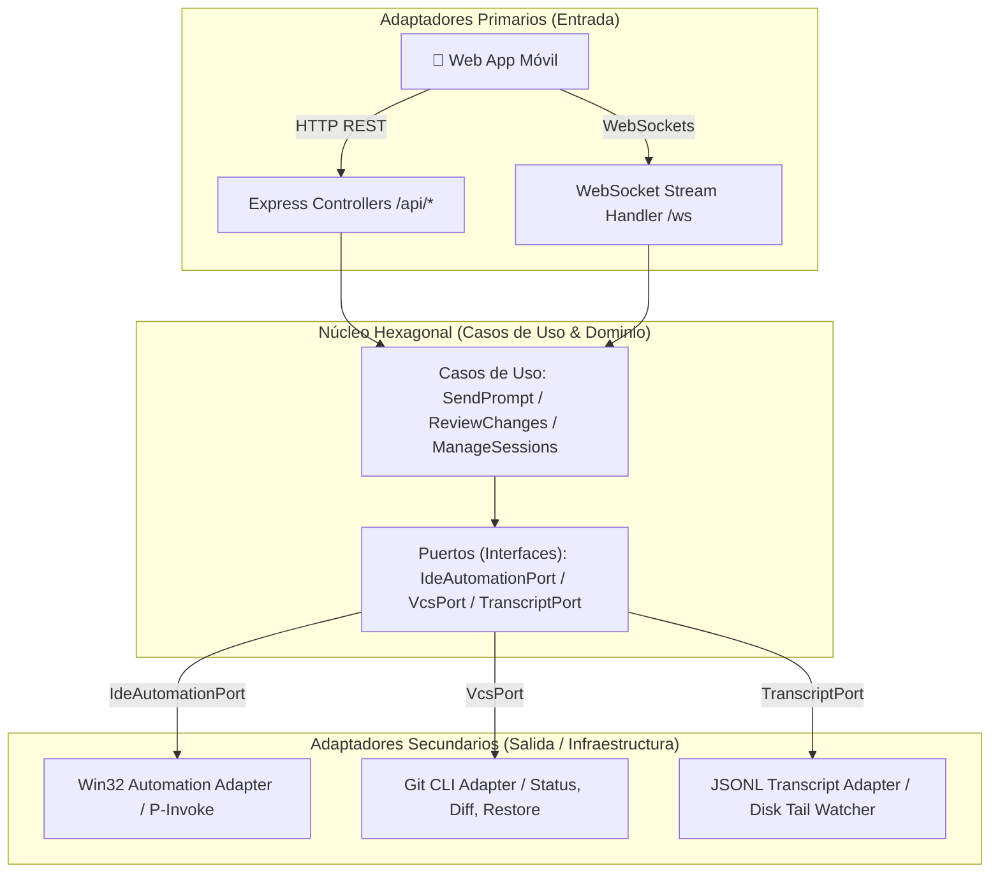

<div align="center">

  

  <br/><br/>

  

  # Pocket Antigravity IDE

  **Controlás tu Antigravity IDE desde el celular sin instalar plugins ni configurar extensiones.**

  <p align="center">
    <a href="#cómo-correrlo"></a>
    <a href="#cómo-correrlo"></a>
    <a href="#cómo-correrlo"></a>
    <a href="#licencia"></a>
  </p>

</div>

---

## Por qué existe esto

Me pasaba todo el tiempo: le pedís al agente de Antigravity una refactorización grande o implementar un módulo completo, y el modelo se queda 2 o 3 minutos pensando, editando archivos y ejecutando comandos.

En ese rato te levantás a buscar un café o vas al living, pero para ver si terminó, responderle una duda o aceptar los cambios que propone, tenés que volver a sentarte frente a la PC.

Armé **Pocket Antigravity** para resolver exactamente eso:
* Poder revisar desde el celular los archivos que el agente modificó línea por línea con diffs en verde y rojo.
* Tocar **Accept All** (`Alt + Enter`) o **Reject** directamente en la pantalla de tu teléfono.
* Mandarle el siguiente prompt de voz, una foto de un error en pantalla o adjuntar un archivo del proyecto sin estar clavado al escritorio.

Todo esto **sin instalar extensiones propietarias**: corre sobre Windows de forma nativa interactuando directamente con el sistema operativo.

---

## Lo que podés hacer (Features clave)

* **Desktop Control Center (Dashboard Host)**: Interfaz de escritorio inspirada en Discord/VirtualBox (`bin/dashboard.bat` o `npm run dashboard`) con diagnóstico automatizado de dependencias (**System Doctor**), conmutador de modos de red (**Wi-Fi Local con 0ms de lag** vs **Túnel Cloudflare**), generador de códigos QR SVG y gestor de energía (**Prevent PC Sleep**).
* **Instalable como PWA en tu celular**: Abrís la app en Chrome (Android) o Safari (iOS) y tocás "Instalar / Agregar a Inicio". Se ejecuta a pantalla completa como una app nativa sin necesidad de compilar APKs.
* **Control remoto total**: Enviás prompts de texto, capturas de cámara o referencias a archivos de tu proyecto con un toque (`@ruta/archivo`).
* **Selector de Personas y Roles**: Cambiá el comportamiento del asistente con chips deslizables (`⚡ Pair Dev`, `🔍 Reviewer`, `📐 Architect`, `🐛 Bug Hunter`, `🎯 Goal`, `💡 Teacher`) enriqueciendo tus prompts automáticamente sin redactar textos largos desde el celular.
* **Revisión y aprobación de Diffs**: Si el agente toca código, aparece un banner en tu teléfono con las estadísticas (`+14 / -3`). Abrís el visor con sintaxis a color y aceptás o descartás los cambios con 1 toque.
* **Streaming en tiempo real**: Ves exactamente lo que el agente va pensando y respondiendo en vivo mediante WebSockets directos.
* **Explorador de tu proyecto**: Navegás el árbol de archivos de tu repositorio y ves el código fuente con syntax highlighting desde el teléfono.
* **Acceso seguro con PIN**: Conexión cifrada protegida por HMAC token de 24h y rate-limiting contra fuerza bruta (5 intentos fallidos = 5 minutos de bloqueo).

---

## Cómo correrlo (En 3 pasos)

### 1. Clonar e instalar
```bash
git clone https://github.com/IvanCR48/Pocket-AntiGravityIDE.git
cd Pocket-AntiGravityIDE
npm install
```

### 2. Iniciar el Control Center o el Servidor
Tenés dos formas de usarlo:

* **Opción A (Recomendada - Control Center de Escritorio)**:
  Hacé doble click en **`bin/dashboard.bat`** (o ejecutá `npm run dashboard`).
  Se abre una ventana estilo Discord con el **System Doctor**, tu QR de Wi-Fi local para conectar al instante con cero lag, y el switch para prender el túnel público cuando salís de tu casa.

* **Opción B (Lanzador Rápido)**:
  Hacé doble click en **`bin/start.bat`** (o ejecutá `npm run app`).
  Inicia el servidor y el túnel en segundo plano mostrando el QR en terminal.

### 3. Conectar desde el celular (PWA)
1. Escaneá el código QR con la cámara de tu celular (o abrí la URL).
2. Ingresá tu PIN de seguridad (por defecto `1234`, configurable desde el Dashboard).
3. **Instalación PWA**: Tocá el botón de instalar o en el menú de Safari/Chrome seleccioná **"Agregar a pantalla de inicio"** para usarlo a pantalla completa como una app nativa sin marcos de navegador.

> Para detener el servidor cuando termines, hacé doble click en **`bin/stop.bat`** (o ejecutá `npm run stop`).

---

## Decisiones técnicas y limitaciones honestas

* **¿Por qué Win32 P/Invoke en vez de un plugin de VS Code?**
  Antigravity IDE no expone una API pública para inyectar texto en su ventana de chat. En vez de depender de parches que se rompan cada vez que el IDE se actualiza, usamos llamadas del sistema operativo (`AttachThreadInput`, `SetForegroundWindow` y `keybd_event`). El sistema localiza la ventana de Chromium/Electron y le pasa el foco de forma transparente.

* **Lectura directa de transcripciones (`.jsonl`)**:
  El servidor no hace scraping de pantalla. Lee incrementalmente los logs de razonamiento que el motor de Antigravity guarda en disco (`.gemini/antigravity-ide/brain/...`). Esto hace que el streaming al celular consuma prácticamente 0% de CPU.

* **Limitaciones actuales**:
  * Solo funciona en **Windows** (debido al inyector Win32).
  * La ventana de Antigravity IDE debe estar abierta en la PC anfitriona.

---

## Arquitectura Hexagonal (Ports & Adapters)

El núcleo del sistema está desacoplado del sistema operativo y los frameworks:



---

## Atajos útiles

Si querés conocer todos los atajos internos del IDE, creamos una guía completa en [ANTIGRAVITY_SHORTCUTS.md](ANTIGRAVITY_SHORTCUTS.md).

---

## Roadmap

- [x] Control remoto de prompts (texto y fotos).
- [x] Streaming de chat en vivo con WebSockets.
- [x] Explorador de archivos del proyecto con visor de código.
- [x] Protección por PIN de seguridad de 4 dígitos.
- [x] Visor de diffs móvil con acciones remotas (Accept All / Reject All).
- [x] Selector de asistentes y personas (Code Reviewer, Arquitecto, Debugger).
- [ ] Atajo de dictado por voz directo al prompt.

---

## Licencia

MIT License — Creado por [IvanCR48](https://github.com/IvanCR48). Podés usarlo, modificarlo y compartirlo libremente.
