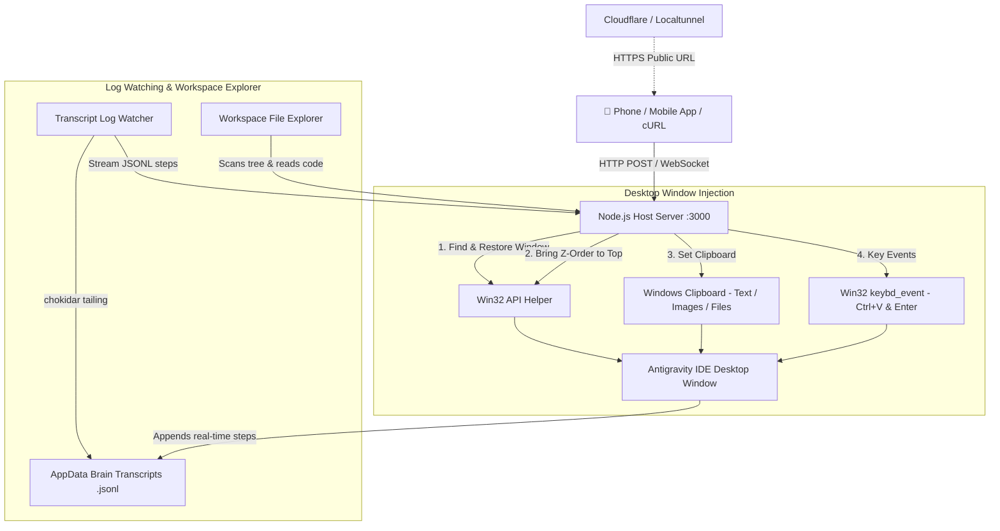

# ✨ Pocket Antigravity IDE

> Remote Control, Real-Time Monitoring & Workspace Exploration Companion for **Antigravity IDE**.

Pocket Antigravity is a mobile-first web app and remote injection server that allows you to control your desktop **Antigravity IDE** from your phone (iOS / Android) or any web browser globally over 4G/5G/Wi-Fi.

---

## 🎨 Features

- **📱 Remote Text & Multimedia Prompts**: Send text prompts, camera photos, and workspace file references from your phone straight into Antigravity IDE.
- **⚡ Zero Plugin Installation**: Works out of the box using native Windows Win32 P/Invoke OS-level window handles & keyboard drivers.
- **➕ New Chat Creation**: Create fresh conversation sessions in 1 tap directly from your phone (`➕ New Chat`).
- **📁 Workspace File Explorer**: Browse your project files, view source code, and attach files with 1 tap (`@path/to/file`).
- **💬 Real-Time Streaming**: Live WebSockets output stream reading `.jsonl` brain transcripts directly from disk.
- **🌐 Global Access Tunnel**: Built-in Cloudflare & Localtunnel launcher for instant HTTPS access anywhere in the world.
- **✨ Antigravity IDE Dark Theme**: Google Fonts (`Inter` & `Fira Code`), full GitHub-Flavored Markdown rendering, and 1-tap **Copy Code** buttons on all code snippets.

---

## 🚀 Quick Start Guide

### 1. Installation
Clone the repository and install dependencies:
```bash
git clone https://github.com/IvanCR48/Pocket-AntiGravityIDE.git
cd Pocket-AntiGravityIDE
npm install
```

### 2. Launch (1-Click)
Double click **`start.bat`** (or run `npm run app` in your terminal).

This will launch:
1. **Pocket Antigravity Server** on `http://localhost:3000`.
2. **Global Access Tunnel** which generates your public HTTPS link and QR code for your phone.

### 3. Stop
Double click **`stop.bat`** (or run `npm run stop`).

---

## 🛠️ Architecture



---

## 📄 License

MIT License - feel free to use, modify, and extend!
