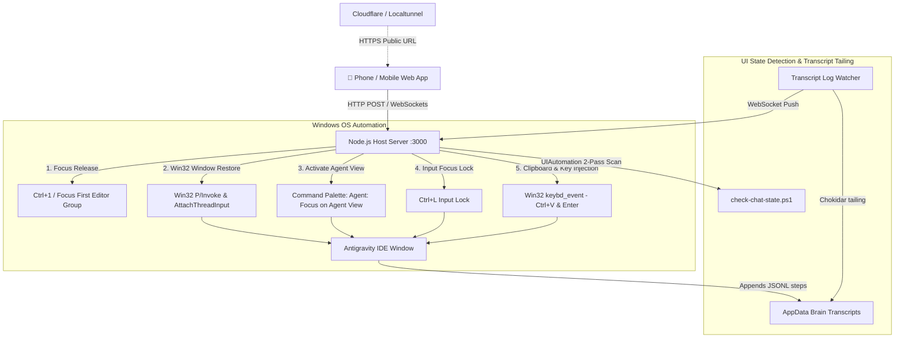

# ✨ Pocket Antigravity IDE

> Remote Control, Real-Time Monitoring & Workspace Exploration Companion for **Antigravity IDE**.

Pocket Antigravity is a mobile-first web app and remote injection server that allows you to control your desktop **Antigravity IDE** from your phone (iOS / Android) or any web browser globally over 4G/5G/Wi-Fi.

---

## 🎨 Features

- **📱 Remote Text & Multimedia Prompts**: Send text prompts, camera photos, and workspace file references from your phone straight into Antigravity IDE.
- **⚡ Zero Plugin Installation**: Works out of the box using native Windows Win32 P/Invoke OS-level window handles & keyboard drivers.
- **➕ New Chat Creation**: Create fresh conversation sessions in 1 tap directly from your phone (`➕ New Chat`).
- **📁 Workspace File Explorer**: Browse your project files, view source code, and attach files with 1 tap (`@path/to/file`).
- **💬 Real-Time Streaming**: Live WebSockets output stream reading `.jsonl` brain transcripts directly from disk.
- **🌐 Global Access Tunnel**: Built-in Cloudflare & Localtunnel launcher for instant HTTPS access anywhere in the world.
- **✨ Antigravity IDE Dark Theme**: Google Fonts (`Inter` & `Fira Code`), full GitHub-Flavored Markdown rendering, and 1-tap **Copy Code** buttons on all code snippets.

---

## 🛠️ Deep Technical Architecture

Pocket Antigravity uses OS-level desktop automation and IPC patterns to interface with Antigravity IDE (Electron/Chromium architecture) without requiring external IDE extensions.



### 1. Win32 Window Restoration & Focus (`Win32ClipboardInjector`)
- **Process & Window Handle Resolution**: Uses `EnumWindows` and `GetClassName` to target the top-level Electron window with window class `Chrome_WidgetWin_1` and process matching `Antigravity`.
- **Z-Order Restoration**: Performs 3-way thread input attachment via `AttachThreadInput(currentThread, targetThread, true)` combined with `OpenIcon(hwnd)` and `SetWindowPos(HWND_TOPMOST)` to reliably bring the IDE window to the foreground across OS focus restrictions.

### 2. Focus Sequence Strategy
To handle focus regardless of whether the user is typing in a code file, interacting with the terminal (`Ctrl+J`), or has the chat panel open/closed:

1. **`Ctrl + 1` (Editor Focus Release)**: Safely releases focus from the Terminal (`xterm.js`), Output panels, or active widgets into the main editor group without opening/closing panels.
2. **Command Palette Activation (`Ctrl+Shift+P` ➔ `"Agent: Focus on Agent View"`)**: Natively opens and activates the Agent View sidebar.
3. **Input Focus Lock (`Ctrl + L`)**: Locks the blinking cursor directly into the prompt text input box.
4. **Deliberate Timing Delay (`focusDelayMs = 500ms`)**: Ensures UI animations complete before injecting text.
5. **Clipboard Paste & Submit (`Ctrl + V` + `Enter`)**: Pastes the prompt text from an STA thread clipboard worker and triggers the enter keystroke.

### 3. UI State Detection (`check-chat-state.ps1`)
- **2-Pass Chromium UIA Activation**: Chromium renderer accessibility trees are dormant by default. The detector issues a 1st-pass query (`FindFirst`) to wake up the accessibility tree, followed by a 2nd-pass query (`FindAll(ControlType.Edit)`) to read active controls.
- **Filter Rules**: Excludes ActivityBar icons, Terminal controls (`xterm`), and Monaco editor code files (`.js`, `.html`, `.css`, etc.) to provide calibrated `FOCUSED`, `OPENED`, and `CLOSED` states.
- **Output Sanitization**: Strips raw control characters and line breaks (`\r\n\t`) from window titles before emitting JSON to guarantee safe parsing.

---

## 🚀 Quick Start Guide

### 1. Installation
Clone the repository and install dependencies:
```bash
git clone https://github.com/IvanCR48/Pocket-AntiGravityIDE.git
cd Pocket-AntiGravityIDE
npm install
```

### 2. Launch (1-Click)
Double click **`start.bat`** (or run `npm run app` in your terminal).

This will launch:
1. **Pocket Antigravity Server** on `http://localhost:3000`.
2. **Global Access Tunnel** which generates your public HTTPS link and QR code for your phone.

### 3. Stop
Double click **`stop.bat`** (or run `npm run stop`).

---

## 📄 License

MIT License - feel free to use, modify, and extend!
