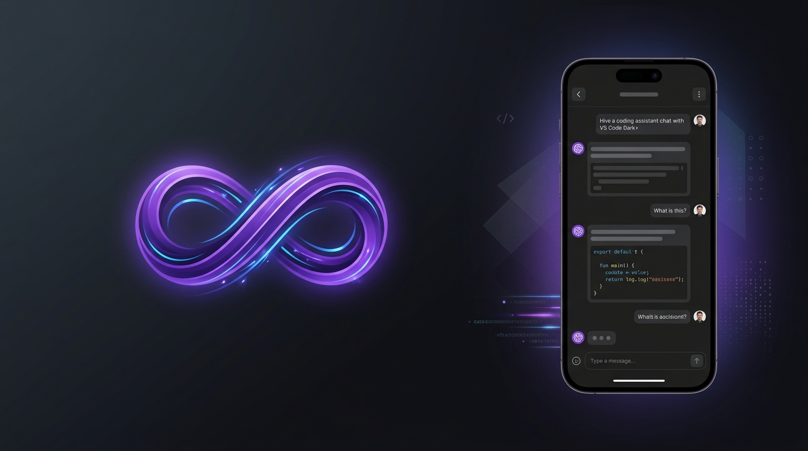
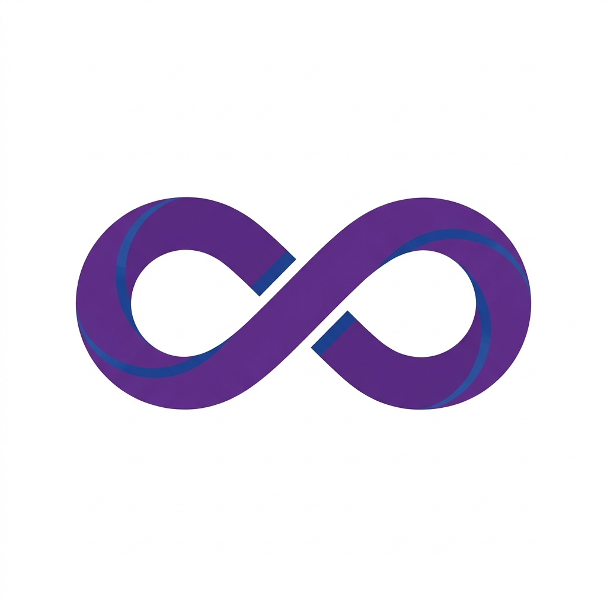
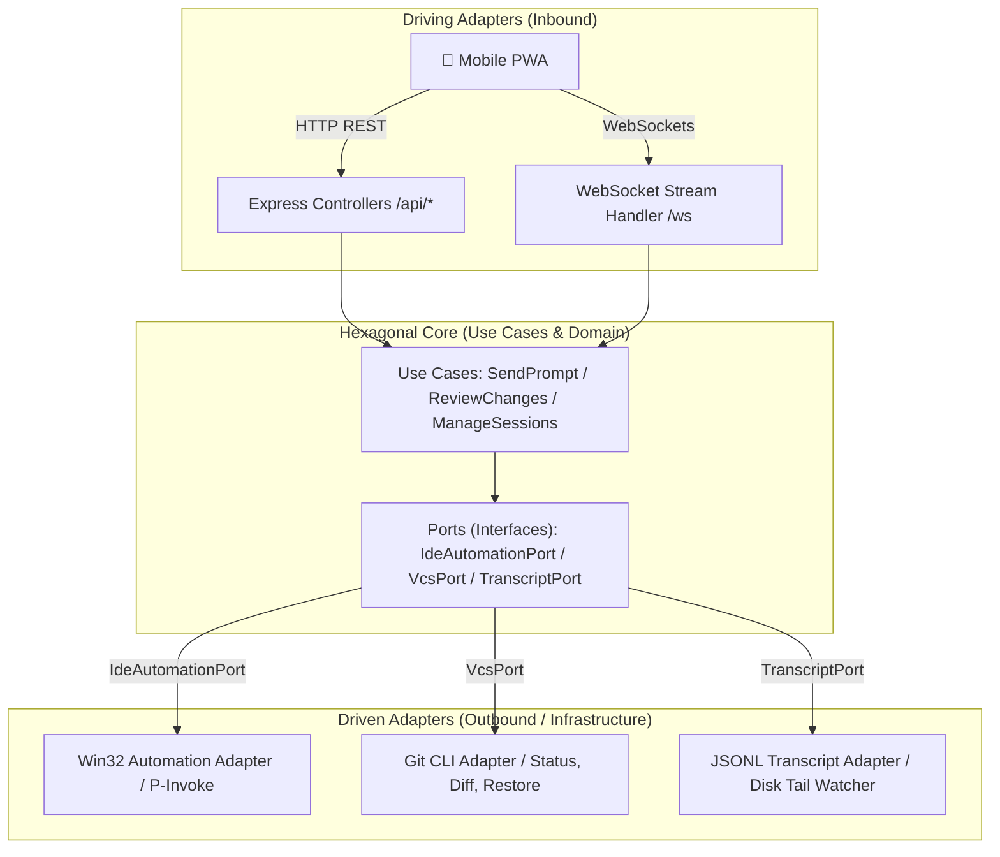

<div align="center">

  

  <br/><br/>

  

  # Pocket Antigravity IDE

  **Control Antigravity IDE from your phone with zero plugins or extensions.**

  <p align="center">
    <a href="#quick-start-in-3-steps"></a>
    <a href="#quick-start-in-3-steps"></a>
    <a href="#quick-start-in-3-steps"></a>
    <a href="#license"></a>
  </p>

</div>

---

## Why this exists

It happened to me all the time: you ask Antigravity's agent for a major refactoring or to implement an entire module from scratch, and it spends 2 to 3 minutes thinking, editing files, and running commands in the background.

During that time, you get up to grab a coffee or relax on the couch. But just to see if it finished, answer a clarifying question, or review the proposed code diffs, you have to walk back and sit at your desk.

I built **Pocket Antigravity** to solve that exact annoyance:
* Review the files modified by the agent line-by-line with syntax-highlighted red/green diffs right on your phone.
* Tap **Accept All** (`Alt + Enter`) or **Reject All** with one touch from your screen.
* Send the next prompt, snap a photo of an error on your display, or attach project files without being tied to your desk.

All of this **without installing any proprietary extensions**: it runs natively on Windows by interacting directly with the operating system.

---

## What you can do (Key Features)

* **Desktop Control Center (Dashboard Host)**: Desktop GUI inspired by modern control centers (`bin/dashboard.bat` or `npm run dashboard`) featuring automated dependency diagnostics (**System Doctor**), connection mode switcher (**Local Wi-Fi with 0ms lag** vs **Global Cloudflare Tunnel**), dynamic SVG QR codes, and power management (**Prevent PC Sleep**).
* **Installable as a Mobile PWA**: Open the web companion in Chrome (Android) or Safari (iOS) and tap "Add to Home Screen". Runs full-screen just like a native app without compiling APKs or dealing with app stores.
* **Full Remote Control**: Send prompts, snap camera photos of errors, or reference project files with a tap (`@path/to/file`).
* **Assistant Persona & Role Switcher**: Change agent behavior instantly with smooth scrolling chips (`⚡ Pair Dev`, `🔍 Reviewer`, `📐 Architect`, `🐛 Bug Hunter`, `🎯 Goal`, `💡 Teacher`), automatically enriching your prompts with expert directives without typing lengthy preambles on mobile.
* **Remote Code Diff Review**: As soon as the agent touches code, a floating banner appears on your phone with live stats (`+14 / -3`). Inspect unified diffs with color-coded syntax and accept or discard changes with 1 tap.
* **Real-Time Streaming**: Watch the agent's step-by-step reasoning and responses stream live over reactive WebSockets.
* **Workspace File Explorer**: Browse your project repository tree and preview source code files with mobile syntax highlighting.
* **PIN Security & Rate Limiting**: Encrypted HMAC token authentication with 24-hour sessions and brute-force protection (5 failed attempts = 5-minute lockout).

---

## Quick Start (in 3 steps)

### 1. Clone & Install
```bash
git clone https://github.com/IvanCR48/Pocket-AntiGravityIDE.git
cd Pocket-AntiGravityIDE
npm run setup
```
*(You can also double-click **`bin/install.bat`** to check and install only missing packages without redownloading existing modules).*

### 2. Launch the Control Center or the Server
Choose how you want to run it:

* **Option A (Recommended - Desktop Control Center)**:
  Double-click **`bin/dashboard.bat`** (or run `npm run dashboard`).
  Opens a desktop window with the **System Doctor**, your local Wi-Fi QR code for zero-lag instant connection, and a one-click toggle for public tunnels when away from home.

* **Option B (Quick CLI Launcher)**:
  Double-click **`bin/start.bat`** (or run `npm run app`).
  Starts the server and shows an interactive terminal menu with QR code and failover tunnel management.

### 3. Connect from your Phone (PWA)
1. Scan the QR code with your phone camera (or open the displayed URL in your mobile browser).
2. Enter your security PIN (defaults to `1234`, configurable from the Dashboard or `pocket.config.json`).
3. **PWA Installation**: Tap the install banner or select **"Add to Home Screen"** in Safari/Chrome to run full-screen as a standalone native app.

> To shut down the server when you are done, double-click **`bin/stop.bat`** (or run `npm run stop`).

---

## Technical Decisions & Honest Trade-offs

* **Why Win32 P/Invoke instead of a VS Code extension?**
  Antigravity IDE does not expose a public API to inject text or simulate actions inside its chat window. Instead of relying on fragile patches that break with every IDE update, we leverage native Windows OS APIs (`AttachThreadInput`, `SetForegroundWindow`, and `keybd_event`). The system locates the Chromium/Electron window and transparently passes focus.

* **Direct Transcript Reading (`.jsonl`)**:
  The server does not perform screen scraping. It incrementally reads the reasoning logs saved directly to disk by Antigravity's engine (`.gemini/antigravity-ide/brain/...`). This keeps background CPU usage near 0%.

* **Current Limitations**:
  * Currently runs on **Windows** (due to the Win32 automation injector).
  * The Antigravity IDE window must be open on the host machine.

---

## Hexagonal Architecture (Ports & Adapters)

The application core is fully decoupled from the operating system and web frameworks:



---

## Useful Shortcuts

If you want to master all internal shortcuts for the IDE, check out our guide in [ANTIGRAVITY_SHORTCUTS.md](ANTIGRAVITY_SHORTCUTS.md).

---

## Roadmap

- [x] Remote prompt control (text & photos).
- [x] Real-time chat streaming with WebSockets.
- [x] Workspace file explorer with syntax-highlighted code viewer.
- [x] 4-digit PIN security lockscreen with HMAC authentication.
- [x] Remote diff review modal with one-tap actions (Accept All / Reject All).
- [x] Assistant persona switcher (Pair Dev, Code Reviewer, Architect, Debugger, Teacher).
- [x] Desktop Control Center & automated System Doctor diagnostics.
- [ ] Direct voice dictation shortcut (Web Speech API).

---

## License

MIT License — Created by [IvanCR48](https://github.com/IvanCR48). Free to use, modify, and share.
