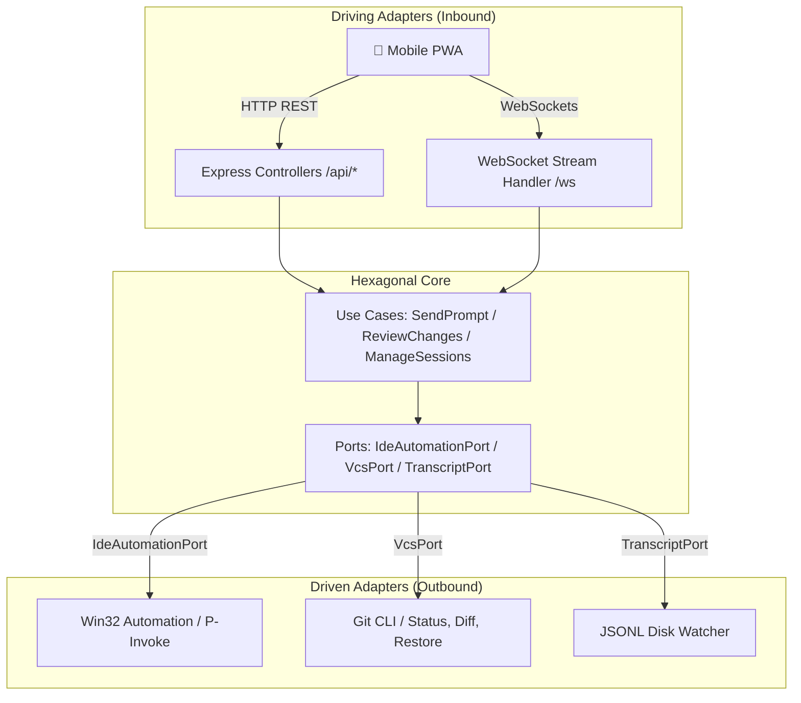

# Pocket Antigravity IDE

Control Google Antigravity IDE from your phone with zero plugins or extensions.

[](https://github.com/IvanCR48/Pocket-AntiGravityIDE)
[](package.json)
[](LICENSE)

---

## Why This Exists

When Antigravity's agent plans a major refactor or implements a complex module, it spends 2 to 3 minutes thinking, editing files, and running commands in the background.

Pocket Antigravity lets you step away from your desk:
- Review file diffs line-by-line on your phone with red/green syntax highlighting.
- Swipe right to accept (`Alt + Enter` + `git add .`) or swipe left to reject (`git restore`).
- Send follow-up prompts, dictate voice instructions, or snap photos of errors without walking back to your keyboard.

It runs locally on Windows without installing any proprietary VS Code or IDE extensions.

---

## Quick Start

### 1. Install Dependencies
Requires Node.js 18+ on Windows 10/11:

```bash
git clone https://github.com/IvanCR48/Pocket-AntiGravityIDE.git
cd Pocket-AntiGravityIDE

npm run setup
```
*(Or double-click `bin/install.bat`)*

### 2. Launch the Host
Choose your preferred launch mode:

* **Desktop Control Center (Recommended)**: Double-click `bin/dashboard.bat` (or run `npm run dashboard`). Opens the GUI with automated System Doctor diagnostics and dynamic QR codes.
* **CLI Launcher**: Double-click `bin/start.bat` (or run `npm run app`).

### 3. Connect from your Phone
1. Connect your phone to the same Wi-Fi network as your PC.
2. Scan the QR code displayed on the screen (or visit the displayed LAN IP).
3. Enter your security PIN (defaults to `1234`, configurable in `pocket.config.json`).
4. *(Optional)* Tap **"Add to Home Screen"** in Safari/Chrome to run as a full-screen PWA.

To stop the background server, double-click `bin/stop.bat` (or run `npm run stop`).

---

## Features & Non-Goals

### Features
* **Native Win32 Injection**: Uses P/Invoke (`AttachThreadInput`, `SetForegroundWindow`, `keybd_event`) to focus Antigravity's chat and paste prompts without brittle UI extensions.
* **"Tinder for Code Reviews"**: Swipe right on file cards to accept changes or swipe left to reject, complete with tactile stamps and physics.
* **Hands-Free Walkie-Talkie Voice**: Dictate prompts using the browser's native Web Speech API with zero API keys and zero cost.
* **Real-Time Streaming**: Tails Antigravity's local `.jsonl` transcript logs and streams the agent's thought process over WebSockets.
* **Desktop Control Center**: Includes a System Doctor, connection switcher (LAN vs Cloudflare Tunnel), and a Windows Keep-Awake toggle to prevent PC sleep during long tasks.
* **PIN Authentication**: Rate-limited HMAC sessions (5 failed attempts trigger a 5-minute lockout).

### Non-Goals
* **Not a cloud editor**: Your code and sessions never leave your local machine; Pocket Antigravity is a remote companion, not a web-based IDE.
* **Not a standalone mobile IDE**: Requires your host PC to be powered on with Antigravity IDE running.
* **No proprietary extensions**: Does not patch or install unverified extensions into Antigravity.
* **No paid external services**: Tunneling relies on standard Cloudflare tunnels and voice transcription runs in the browser.

---

## Architecture

Built with Hexagonal Architecture (Ports and Adapters) to isolate OS automation from network delivery:



---

## Testing

Run the automated test suite (46 unit and integration tests):

```bash
npm test
```

---

## Shortcuts Reference

For full internal keyboard shortcuts and key mappings, see [ANTIGRAVITY_SHORTCUTS.md](ANTIGRAVITY_SHORTCUTS.md).

---

## License

[MIT](LICENSE) — Created by [IvanCR48](https://github.com/IvanCR48).
